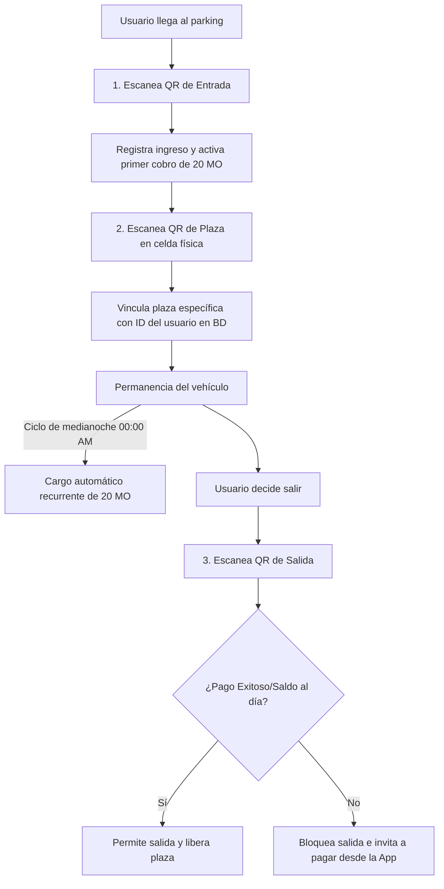

# Arquitectura Técnica y Especificaciones de Diseño: Aerolíneas Oceánicas

Este documento detalla la arquitectura de software, el perímetro de seguridad, el modelo de datos híbrido (SQL/NoSQL) y los componentes frontend para la plataforma **Aerolíneas Oceánicas**.

---

## 1. ARCHITECTURE & SECURITY PERIMETER

### Middleware de Protección Perimetral y Autenticación con Koa.js

A continuación se presenta la implementación en Koa.js del middleware de protección perimetral por contraseña (Gatekeeper) y la lógica de autenticación mediante Google OAuth 2.0, inyectando el bono de bienvenida de 5,000 Monedas Oceánicas para nuevos usuarios.

```javascript
// server.js / middleware/gatekeeper.js
const Koa = require('koa');
const Router = require('@koa/router');
const bodyParser = require('koa-bodyparser');
const session = require('koa-session');
const { OAuth2Client } = require('google-auth-library');
const { Pool } = require('pg'); // Cliente de PostgreSQL

const app = new Koa();
const router = new Router();
const googleClient = new OAuth2Client(process.env.GOOGLE_CLIENT_ID);

// Pool de conexión a PostgreSQL
const db = new Pool({
  connectionString: process.env.DATABASE_URL
});

app.keys = [process.env.SESSION_SECRET || 'secret-key-oceanic'];
app.use(session(app));
app.use(bodyParser());

/**
 * 1. Middleware Gatekeeper (Contraseña Perimetral Global)
 * Bloquea cualquier petición si no se ha superado el reto de la contraseña perimetral.
 */
const GATEKEEPER_PASSWORD = process.env.GATEKEEPER_PASSWORD || 'OceanoSeguro2026';

async function gatekeeperMiddleware(ctx, next) {
  // Rutas públicas exceptuadas del control perimetral (ej. login perimetral)
  if (ctx.path === '/api/gatekeeper/verify' || ctx.path === '/gatekeeper-login') {
    return await next();
  }

  // Verificar si la sesión ya superó el gatekeeper
  if (ctx.session.gatekeeperPassed) {
    return await next();
  }

  // De lo contrario, denegar el acceso
  ctx.status = 401;
  ctx.body = {
    error: 'Acceso bloqueado por el perímetro de seguridad (Gatekeeper). Se requiere autenticación global.',
    code: 'GATEKEEPER_REQUIRED'
  };
}

app.use(gatekeeperMiddleware);

// Endpoint para verificar la contraseña perimetral
router.post('/api/gatekeeper/verify', async (ctx) => {
  const { password } = ctx.request.body;

  if (password === GATEKEEPER_PASSWORD) {
    ctx.session.gatekeeperPassed = true;
    ctx.status = 200;
    ctx.body = { success: true, message: 'Acceso perimetral concedido.' };
  } else {
    ctx.status = 401;
    ctx.body = { error: 'Contraseña incorrecta.' };
  }
});

/**
 * 2. Autenticación con Google API e Inyección de Bono de Bienvenida (5,000 Monedas Oceánicas)
 */
router.post('/api/auth/google', async (ctx) => {
  const { token } = ctx.request.body;

  try {
    const ticket = await googleClient.verifyIdToken({
      idToken: token,
      audience: process.env.GOOGLE_CLIENT_ID,
    });

    const payload = ticket.getPayload();
    const { sub: googleId, email, name, picture } = payload;

    // Verificar si el usuario ya existe en PostgreSQL
    let userResult = await db.query('SELECT * FROM usuarios WHERE google_id = $1', [googleId]);
    let user = userResult.rows[0];
    let isNewUser = false;

    if (!user) {
      isNewUser = true;
      // Registrar nuevo usuario e inyectar el bono de bienvenida de 5000 Monedas Oceánicas
      const insertResult = await db.query(
        `INSERT INTO usuarios (google_id, email, nombre, avatar, saldo_monedas, rol)
         VALUES ($1, $2, $3, $4, $5, $6) RETURNING *`,
        [googleId, email, name, picture, 5000.00, 'Cliente']
      );
      user = insertResult.rows[0];

      // Registrar la transacción de bienvenida
      await db.query(
        `INSERT INTO transacciones (usuario_id, tipo, monto, descripcion)
         VALUES ($1, 'Bono Bienvenida', 5000.00, 'Inyección inicial por registro de nuevo usuario')`,
        [user.id]
      );
    }

    // Guardar información del usuario en la sesión de Koa
    ctx.session.user = {
      id: user.id,
      email: user.email,
      nombre: user.nombre,
      rol: user.rol,
      saldo: user.saldo_monedas
    };

    ctx.status = 200;
    ctx.body = {
      success: true,
      user: ctx.session.user,
      isNewUser
    };
  } catch (error) {
    ctx.status = 400;
    ctx.body = { error: 'Token de Google inválido o error en autenticación.' };
  }
});

app.use(router.routes()).use(router.allowedMethods());
```

### Estrategia de Ciberseguridad Contra Vectores de Ataque en la API

#### 1. Mitigación de Inyección SQL (SQLi) en la Gestión de Vuelos
*   **Consultas Parametrizadas y Prepared Statements**: Queda estrictamente prohibida la concatenación de variables en consultas SQL. Se deben usar placeholders (`$1`, `$2`) provistos por los conectores nativos de PostgreSQL.
*   **Uso de un ORM/Query Builder Seguro**: Opcionalmente, utilizar herramientas como Prisma o Knex.js que escapan de manera nativa todos los inputs.
*   **Sanitización y Validación del Esquema**: Implementar validadores de tipos de datos en los parámetros de búsqueda de vuelos (por ejemplo, validar que los campos de fecha tengan el formato `YYYY-MM-DD` y que los precios de presupuesto sean números reales positivos) utilizando la biblioteca `Joi` o `Zod`.

#### 2. Mitigación de Cross-Site Scripting (XSS) en Datos del Mapa
*   **Codificación de Salida (Output Encoding)**: Al renderizar destinos turísticos y comentarios de usuarios en el mapa, los motores de frontend (React) escapan automáticamente las etiquetas HTML por defecto. Sin embargo, se debe evitar explícitamente el uso de `dangerouslySetInnerHTML` en React.
*   **Sanitización de Contenido**: Si se requiere interpretar HTML dinámico en el cliente, se debe procesar mediante la biblioteca `DOMPurify` antes de renderizarlo.
*   **Política de Seguridad de Contenido (CSP)**: Configurar cabeceras HTTP de seguridad para restringir el origen de los scripts y estilos autorizados a ejecutarse en la aplicación:
    ```javascript
    const helmet = require('koa-helmet');
    app.use(helmet.contentSecurityPolicy({
      directives: {
        defaultSrc: ["'self'"],
        scriptSrc: ["'self'", "https://accounts.google.com"],
        styleSrc: ["'self'", "'unsafe-inline'"],
        imgSrc: ["'self'", "data:", "https://lh3.googleusercontent.com"], // Fotos de perfil de Google
      }
    }));
    ```

---

## 2. DATABASE ARCHITECTURE (Esquema Híbrido SQL/NoSQL)

La plataforma utiliza una arquitectura políglota para beneficiarse de la consistencia de SQL en transacciones y la flexibilidad de NoSQL en auditorías y logs de búsqueda.

### Esquema Relacional PostgreSQL (Consistencia Transaccional)

```sql
-- Tabla de Usuarios y Roles (RBAC)
CREATE TABLE usuarios (
    id SERIAL PRIMARY KEY,
    google_id VARCHAR(255) UNIQUE NOT NULL,
    email VARCHAR(255) UNIQUE NOT NULL,
    nombre VARCHAR(255) NOT NULL,
    avatar TEXT,
    saldo_monedas DECIMAL(12, 2) NOT NULL DEFAULT 5000.00,
    rol VARCHAR(50) NOT NULL DEFAULT 'Cliente' CHECK (rol IN ('Cliente', 'Servicio al Cliente', 'Gerente', 'Administrador')),
    created_at TIMESTAMP WITH TIME ZONE DEFAULT CURRENT_TIMESTAMP
);

-- Tabla de Vuelos (Ficticios pero realistas)
CREATE TABLE vuelos (
    id SERIAL PRIMARY KEY,
    codigo_vuelo VARCHAR(10) UNIQUE NOT NULL,
    origen VARCHAR(100) NOT NULL,
    destino_pais VARCHAR(100) NOT NULL,
    destino_ciudad VARCHAR(100) NOT NULL,
    fecha_salida TIMESTAMP WITH TIME ZONE NOT NULL,
    fecha_llegada TIMESTAMP WITH TIME ZONE NOT NULL,
    duracion_vuelo_minutos INT NOT NULL,
    precio_monedas DECIMAL(10, 2) NOT NULL,
    asientos_disponibles INT NOT NULL,
    created_at TIMESTAMP WITH TIME ZONE DEFAULT CURRENT_TIMESTAMP
);

-- Tabla de Reservas de Vuelos
CREATE TABLE reservas (
    id SERIAL PRIMARY KEY,
    usuario_id INT REFERENCES usuarios(id) ON DELETE CASCADE,
    vuelo_id INT REFERENCES vuelos(id) ON DELETE CASCADE,
    fecha_reserva TIMESTAMP WITH TIME ZONE DEFAULT CURRENT_TIMESTAMP,
    monto_pagado DECIMAL(10, 2) NOT NULL,
    estado VARCHAR(50) DEFAULT 'Confirmado' CHECK (estado IN ('Confirmado', 'Cancelado'))
);

-- Tabla de Transacciones Financieras (Monedas Oceánicas)
CREATE TABLE transacciones (
    id SERIAL PRIMARY KEY,
    usuario_id INT REFERENCES usuarios(id) ON DELETE CASCADE,
    tipo VARCHAR(50) NOT NULL CHECK (tipo IN ('Bono Bienvenida', 'Compra Vuelo', 'Reserva Parking', 'Reembolso', 'Ajuste Manual')),
    monto DECIMAL(10, 2) NOT NULL,
    descripcion TEXT,
    fecha_transaccion TIMESTAMP WITH TIME ZONE DEFAULT CURRENT_TIMESTAMP
);

-- Tabla de Ocupación de Parking
CREATE TABLE parking_slots (
    id SERIAL PRIMARY KEY,
    identificador_plaza VARCHAR(50) UNIQUE NOT NULL,
    estado VARCHAR(50) NOT NULL DEFAULT 'Libre' CHECK (estado IN ('Libre', 'Ocupado')),
    usuario_id INT REFERENCES usuarios(id) ON DELETE SET NULL,
    fecha_entrada TIMESTAMP WITH TIME ZONE,
    ultimo_cargo TIMESTAMP WITH TIME ZONE
);
```

### Esquema MongoDB (Historial y Flujo NoSQL)

#### Colección: `search_history`
Almacena el registro dinámico de consultas y filtrados del mapa interactivo realizados por los usuarios.
```json
{
  "_id": "ObjectId",
  "usuario_id": "Number (PostgreSQL ID, null si es anónimo)",
  "timestamp": "ISODate",
  "filtros": {
    "presupuesto_maximo": 4500.00,
    "gustos": ["Playa", "Montaña"],
    "tiempo_disponible_horas": 72,
    "destinos_deseados": ["Chile", "Perú"],
    "destinos_no_visitados_solo": true
  },
  "resultados_obtenidos": ["Vuelo-102", "Vuelo-105"],
  "user_agent": "String",
  "ip_address": "String"
}
```

#### Colección: `ticket_escalations`
Esquema del flujo de incidencias con la trazabilidad y la matriz de escalación (Cliente -> Servicio -> Gerente -> Administrador) junto a firmas de auditoría de seguridad.
```json
{
  "_id": "ObjectId",
  "ticket_codigo": "INC-2026-9874",
  "cliente_id": 42,
  "fecha_creacion": "2026-07-06T10:00:00Z",
  "descripcion_problema": "Cargo duplicado en reserva de estacionamiento plaza B-12",
  "historial_estados": [
    {
      "estado": "Abierto",
      "asignado_a_rol": "Servicio al Cliente",
      "usuario_nombre": "Carlos Gómez",
      "comentario": "Revisión inicial del caso. Se valida cargo duplicado pero no tengo permisos de reembolso.",
      "fecha": "2026-07-06T10:15:00Z"
    },
    {
      "estado": "Escalado a Gerente",
      "asignado_a_rol": "Gerente",
      "usuario_nombre": "Carlos Gómez",
      "comentario": "Se escala para procesamiento de reembolso monetario.",
      "fecha": "2026-07-06T10:18:00Z"
    }
  ],
  "estado_actual": "Escalado a Gerente",
  "nivel_prioridad": "Alta",
  "datos_auditoria": {
    "ip_origen": "190.15.22.4",
    "token_sesion_hash": "e3b0c44298fc1c149afbf4c8996fb92427ae41e4649b934ca495991b7852b855"
  }
}
```

### Datos Semilla (Seed Data)

Datos semilla de vuelos ficticios comprendidos en la ventana temporal del lunes 06 de julio de 2026 al sábado 11 de julio de 2026, incluyendo los destinos turísticos principales y precios.

```sql
-- Inserción de vuelos ficticios en América Latina
INSERT INTO vuelos (codigo_vuelo, origen, destino_pais, destino_ciudad, fecha_salida, fecha_llegada, duracion_vuelo_minutos, precio_monedas, asientos_disponibles) VALUES
-- Vuelos del lunes 06/Julio/2026
('OC-101', 'Ciudad de México, MX', 'Colombia', 'Bogotá', '2026-07-06 08:00:00-06', '2026-07-06 12:30:00-05', 270, 1200.00, 150),
('OC-102', 'Ciudad de México, MX', 'Chile', 'Santiago', '2026-07-06 14:00:00-06', '2026-07-06 22:30:00-04', 510, 2400.00, 120),
('OC-103', 'Ciudad de México, MX', 'Perú', 'Lima', '2026-07-06 09:30:00-06', '2026-07-06 15:45:00-05', 375, 1800.00, 180),

-- Vuelos del martes 07/Julio/2026
('OC-201', 'Bogotá, CO', 'Brasil', 'Río de Janeiro', '2026-07-07 10:00:00-05', '2026-07-07 18:30:00-03', 390, 2200.00, 140),
('OC-202', 'Lima, PE', 'Argentina', 'Buenos Aires', '2026-07-07 11:00:00-05', '2026-07-07 16:30:00-03', 270, 1500.00, 160),

-- Vuelos del miércoles 08/Julio/2026
('OC-301', 'Buenos Aires, AR', 'Colombia', 'Medellín', '2026-07-08 07:00:00-03', '2026-07-08 12:30:00-05', 390, 2100.00, 110),
('OC-302', 'Santiago, CL', 'Perú', 'Cusco', '2026-07-08 13:00:00-04', '2026-07-08 16:30:00-05', 270, 1600.00, 95),

-- Vuelos del jueves 09/Julio/2026
('OC-401', 'Río de Janeiro, BR', 'Chile', 'Santiago', '2026-07-09 15:00:00-03', '2026-07-09 19:30:00-04', 330, 1900.00, 130),

-- Vuelos del viernes 10/Julio/2026
('OC-501', 'Bogotá, CO', 'Costa Rica', 'San José', '2026-07-10 09:00:00-05', '2026-07-10 11:15:00-06', 135, 950.00, 80),

-- Vuelos del sábado 11/Julio/2026
('OC-601', 'San José, CR', 'México', 'Cancún', '2026-07-11 12:00:00-06', '2026-07-11 14:30:00-06', 150, 1100.00, 190);
```

#### Información de Lugares Turísticos por País (Disponibles en el Frontend Modal)
```json
{
  "Colombia": [
    {"nombre": "Santuario de Las Lajas", "categoria": "Cultura/Montaña", "descripcion": "Una joya arquitectónica construida sobre un cañón."},
    {"nombre": "Parque Nacional Natural Tayrona", "categoria": "Playa", "descripcion": "Bahías de arena blanca rodeadas de selva tropical."},
    {"nombre": "Catedral de Sal de Zipaquirá", "categoria": "Cultura", "descripcion": "Una iglesia subterránea tallada completamente en sal."}
  ],
  "Chile": [
    {"nombre": "Torres del Paine", "categoria": "Montaña", "descripcion": "Imponentes montañas y glaciares en la Patagonia."},
    {"nombre": "Desierto de Atacama", "categoria": "Aventura", "descripcion": "El desierto no polar más árido de la Tierra."},
    {"nombre": "Isla de Pascua", "categoria": "Cultura/Playa", "descripcion": "Famosa por sus enigmáticas estatuas de piedra Moái."}
  ],
  "Perú": [
    {"nombre": "Machu Picchu", "categoria": "Cultura/Montaña", "descripcion": "La legendaria ciudadela inca en las alturas de los Andes."},
    {"nombre": "Líneas de Nazca", "categoria": "Cultura/Misterio", "descripcion": "Geoglifos antiguos grabados en las arenas del desierto."},
    {"nombre": "Lago Titicaca", "categoria": "Naturaleza/Cultura", "descripcion": "El lago navegable más alto del mundo."}
  ],
  "Brasil": [
    {"nombre": "Cristo Redentor", "categoria": "Cultura", "descripcion": "Estatua icónica que corona el cerro del Corcovado."},
    {"nombre": "Cataratas del Iguazú", "categoria": "Naturaleza", "descripcion": "Uno de los sistemas de cascadas más grandes del mundo."},
    {"nombre": "Playa de Copacabana", "categoria": "Playa", "descripcion": "Famosa playa en forma de media luna en Río de Janeiro."}
  ]
}
```

---

## 3. FRONTEND COMPONENTS & UX/UI DESIGN (React + Tailwind CSS)

### Componente de Mapa Interactivo e Buscador Inteligente

Diseñado utilizando Tailwind CSS con una base estética de Azul Marino (`#162b4e`). Cuenta con hover, modal de lugares turísticos, y buscador con cálculo neto de tiempo de visita y filtro de destinos no visitados.

```javascript
// InteractiveMap.jsx
import React, { useState, useEffect } from 'react';
import axios from 'axios';

// Datos estáticos de lugares turísticos para demostración
const lugaresTuristicos = {
  "Colombia": [
    { nombre: "Parque Tayrona", categoria: "Playa", desc: "Playa y selva tropical." },
    { nombre: "Santuario de Las Lajas", categoria: "Montaña", desc: "Templo gótico en un acantilado." },
    { nombre: "Catedral de Sal", categoria: "Cultura", desc: "Iglesia subterránea." }
  ],
  "Chile": [
    { nombre: "Torres del Paine", categoria: "Montaña", desc: "Senderismo glacial." },
    { nombre: "Atacama", categoria: "Aventura", desc: "El desierto más árido del mundo." },
    { nombre: "Isla de Pascua", categoria: "Cultura", desc: "Estatuas Moái ancestrales." }
  ],
  "Perú": [
    { nombre: "Machu Picchu", categoria: "Montaña", desc: "Santuario Inca." },
    { nombre: "Líneas de Nazca", desc: "Geoglifos antiguos." },
    { nombre: "Lago Titicaca", desc: "Islas flotantes." }
  ]
};

export default function InteractiveMap({ userSession }) {
  const [hoveredCountry, setHoveredCountry] = useState(null);
  const [selectedCountry, setSelectedCountry] = useState(null);
  const [vuelos, setVuelos] = useState([]);
  
  // Estados del Buscador Inteligente
  const [presupuesto, setPresupuesto] = useState('');
  const [gusto, setGusto] = useState('');
  const [tiempoDisponible, setTiempoDisponible] = useState('');
  const [soloNoVisitados, setSoloNoVisitados] = useState(false);
  const [vuelosFiltrados, setVuelosFiltrados] = useState([]);

  useEffect(() => {
    // Carga inicial de vuelos
    axios.get('/api/vuelos')
      .then(res => setVuelos(res.data))
      .catch(err => console.error(err));
  }, []);

  // Simulación de filtro inteligente
  const handleSearch = (e) => {
    e.preventDefault();
    let res = vuelos;

    // 1. Filtro por presupuesto
    if (presupuesto) {
      res = res.filter(v => parseFloat(v.precio_monedas) <= parseFloat(presupuesto));
    }

    // 2. Filtro por destinos no visitados (Lógica de negocio solicitada)
    if (soloNoVisitados && userSession?.ciudadesVisitadas) {
      res = res.filter(v => !userSession.ciudadesVisitadas.includes(v.destino_ciudad));
    }

    setVuelosFiltrados(res);
  };

  /**
   * Módulo 1: Algoritmo de recomendación y cálculo de tiempo neto de estancia
   */
  const calcularTiempoNetoEstancia = (duracionVueloIdaVueltaMinutos) => {
    if (!tiempoDisponible) return null;
    const tiempoDisponibleMinutos = parseFloat(tiempoDisponible) * 60;
    const tiempoNetoMinutos = tiempoDisponibleMinutos - duracionVueloIdaVueltaMinutos;
    const tiempoNetoHoras = (tiempoNetoMinutos / 60).toFixed(1);

    // Advertencia si el tiempo de vuelo consume más del 40% del tiempo total disponible
    const porcentajeConsumido = (duracionVueloIdaVueltaMinutos / tiempoDisponibleMinutos) * 100;
    const tieneRiesgoRetraso = porcentajeConsumido > 40;

    return {
      horas: tiempoNetoHoras,
      riesgo: tieneRiesgoRetraso,
      porcentajeConsumido: porcentajeConsumido.toFixed(0)
    };
  };

  return (
    <div className="min-h-screen bg-[#162b4e] text-white p-8 font-sans">
      <header className="max-w-6xl mx-auto mb-8 border-b border-blue-800 pb-4">
        <h1 className="text-3xl font-extrabold tracking-tight">Panel de Reservas: Aerolíneas Oceánicas</h1>
        <p className="text-blue-200">Buscador Inteligente sobre Mapa Interactivo de América Latina</p>
      </header>

      <div className="max-w-6xl mx-auto grid grid-cols-1 lg:grid-cols-3 gap-8">
        
        {/* Buscador de Vuelos */}
        <div className="bg-slate-900/60 backdrop-blur border border-blue-900/50 p-6 rounded-2xl shadow-xl">
          <h2 className="text-xl font-bold mb-4 text-blue-400">Buscador Inteligente</h2>
          <form onSubmit={handleSearch} className="space-y-4">
            <div>
              <label className="block text-sm font-medium mb-1">Presupuesto Máximo (Monedas Oceánicas)</label>
              <input 
                type="number" 
                value={presupuesto} 
                onChange={e => setPresupuesto(e.target.value)}
                className="w-full bg-slate-800/80 border border-blue-950 focus:border-blue-500 rounded-lg p-2.5 text-white"
                placeholder="Ej. 2000"
              />
            </div>
            <div>
              <label className="block text-sm font-medium mb-1">Tiempo Disponible (Horas Totales)</label>
              <input 
                type="number" 
                value={tiempoDisponible} 
                onChange={e => setTiempoDisponible(e.target.value)}
                className="w-full bg-slate-800/80 border border-blue-950 focus:border-blue-500 rounded-lg p-2.5 text-white"
                placeholder="Ej. 48"
              />
            </div>
            <div>
              <label className="block text-sm font-medium mb-1">Categoría de Interés</label>
              <select 
                value={gusto} 
                onChange={e => setGusto(e.target.value)}
                className="w-full bg-slate-800/80 border border-blue-950 focus:border-blue-500 rounded-lg p-2.5 text-white"
              >
                <option value="">Todas</option>
                <option value="Playa">Playa</option>
                <option value="Montaña">Montaña</option>
                <option value="Aventura">Aventura</option>
              </select>
            </div>
            <div className="flex items-center space-x-2 py-2">
              <input 
                type="checkbox" 
                id="noVisitados" 
                checked={soloNoVisitados}
                onChange={e => setSoloNoVisitados(e.target.checked)}
                className="rounded border-blue-950 text-blue-600 focus:ring-blue-500 bg-slate-800"
              />
              <label htmlFor="noVisitados" className="text-sm select-none">Mostrar sólo destinos no visitados</label>
            </div>
            <button type="submit" className="w-full py-3 bg-blue-600 hover:bg-blue-500 font-bold rounded-xl transition duration-200 shadow-lg shadow-blue-600/30">
              Buscar Destinos
            </button>
          </form>
        </div>

        {/* Representación de Mapa Interactivo SVG */}
        <div className="lg:col-span-2 bg-slate-900/40 border border-blue-900/30 p-6 rounded-2xl flex flex-col items-center justify-center relative min-h-[400px]">
          <h3 className="absolute top-4 left-4 text-sm font-semibold tracking-wider uppercase text-blue-500">Mapa de América Latina</h3>
          
          <div className="w-full max-w-[320px] h-auto text-blue-900 fill-current">
            <svg viewBox="0 0 400 600" className="w-full h-full">
              {/* Ejemplo simplificado de contornos SVG de países */}
              {/* Colombia */}
              <path 
                d="M 120 180 L 170 200 L 150 240 L 110 210 Z" 
                className={`transition-colors duration-250 cursor-pointer ${
                  hoveredCountry === 'Colombia' ? 'fill-emerald-400' : 'fill-blue-950 stroke-blue-800'
                }`}
                onMouseEnter={() => setHoveredCountry('Colombia')}
                onMouseLeave={() => setHoveredCountry(null)}
                onClick={() => setSelectedCountry('Colombia')}
              />
              {/* Perú */}
              <path 
                d="M 110 215 L 148 243 L 120 310 L 90 280 Z" 
                className={`transition-colors duration-250 cursor-pointer ${
                  hoveredCountry === 'Perú' ? 'fill-emerald-400' : 'fill-blue-950 stroke-blue-800'
                }`}
                onMouseEnter={() => setHoveredCountry('Perú')}
                onMouseLeave={() => setHoveredCountry(null)}
                onClick={() => setSelectedCountry('Perú')}
              />
              {/* Chile */}
              <path 
                d="M 115 315 L 130 315 L 105 520 L 95 520 Z" 
                className={`transition-colors duration-250 cursor-pointer ${
                  hoveredCountry === 'Chile' ? 'fill-emerald-400' : 'fill-blue-950 stroke-blue-800'
                }`}
                onMouseEnter={() => setHoveredCountry('Chile')}
                onMouseLeave={() => setHoveredCountry(null)}
                onClick={() => setSelectedCountry('Chile')}
              />
            </svg>
          </div>

          {hoveredCountry && (
            <div className="absolute bottom-4 bg-slate-900 border border-emerald-500 px-4 py-2 rounded-xl text-emerald-400 text-sm font-semibold shadow-lg">
              Explorar {hoveredCountry}
            </div>
          )}
        </div>
      </div>

      {/* Modal de Destinos de País Seleccionado */}
      {selectedCountry && (
        <div className="fixed inset-0 bg-black/75 backdrop-blur-sm flex items-center justify-center p-4 z-50 animate-fade-in">
          <div className="bg-[#162b4e] border border-blue-800 max-w-2xl w-full p-8 rounded-3xl relative shadow-2xl">
            <button 
              onClick={() => setSelectedCountry(null)}
              className="absolute top-4 right-4 text-blue-300 hover:text-white text-2xl font-bold focus:outline-none"
            >
              &times;
            </button>
            <h3 className="text-2xl font-bold mb-4 text-white">Destinos Imperdibles en {selectedCountry}</h3>
            
            <div className="grid grid-cols-1 md:grid-cols-3 gap-4 mb-6">
              {lugaresTuristicos[selectedCountry]?.map((lug, idx) => (
                <div key={idx} className="bg-slate-950/40 border border-blue-950 p-4 rounded-xl">
                  <span className="text-xs uppercase font-bold tracking-wider text-emerald-400 block mb-1">{lug.categoria}</span>
                  <h4 className="font-bold text-white mb-2">{lug.nombre}</h4>
                  <p className="text-xs text-blue-200">{lug.desc}</p>
                </div>
              ))}
            </div>

            <h4 className="font-bold text-lg mb-2 text-blue-400">Vuelos Disponibles en la Ventana Temporal (Julio 6 - 11, 2026)</h4>
            <div className="space-y-3 max-h-[200px] overflow-y-auto pr-2">
              {vuelos.filter(v => v.destino_pais === selectedCountry).map((v, i) => {
                const infoEstancia = calcularTiempoNetoEstancia(v.duracion_vuelo_minutos * 2);
                return (
                  <div key={i} className="bg-slate-950/60 p-4 rounded-xl flex flex-col md:flex-row justify-between items-start md:items-center border border-blue-900/40">
                    <div>
                      <div className="flex items-center space-x-2">
                        <span className="bg-blue-600 px-2 py-0.5 rounded text-xs font-bold">{v.codigo_vuelo}</span>
                        <span className="font-bold text-white">{v.destino_ciudad}</span>
                      </div>
                      <p className="text-xs text-blue-300 mt-1">Salida: {new Date(v.fecha_salida).toLocaleDateString()}</p>
                      {infoEstancia && (
                        <div className="mt-2 text-xs">
                          <p className="text-emerald-400">Estancia neta: {infoEstancia.horas} horas</p>
                          {infoEstancia.riesgo && (
                            <p className="text-amber-400 font-medium">
                              ⚠️ El vuelo consume {infoEstancia.porcentajeConsumido}% de tu viaje. Alto riesgo por retrasos aéreos.
                            </p>
                          )}
                        </div>
                      )}
                    </div>
                    <div className="mt-2 md:mt-0 text-right">
                      <span className="block font-bold text-lg text-emerald-400">{v.precio_monedas} MO</span>
                      <button className="mt-1 px-4 py-1.5 bg-emerald-500 hover:bg-emerald-400 text-slate-950 font-bold rounded-lg text-xs transition">
                        Reservar
                      </button>
                    </div>
                  </div>
                );
              })}
            </div>
          </div>
        </div>
      )}
    </div>
  );
}
```

---

## 4. PARKING & TIMES LOGIC (Lógica de Negocio y Tiempos del Estacionamiento)

### Flujo de Escaneo de Códigos QR (3 Pasos)



### Algoritmo del Servidor para Cobro a Medianoche (00:00 AM)

El siguiente es el algoritmo asíncrono para ser ejecutado mediante un Cron Job en Node.js/Koa a las `00:00 AM` de la zona horaria del servidor. Realiza la deducción automática de saldo de 20 Monedas Oceánicas y bloquea el estado de salida si el usuario tiene saldo insuficiente.

```javascript
// cron/parkingBillingJob.js
const { Pool } = require('pg');
const db = new Pool({ connectionString: process.env.DATABASE_URL });

async function processMidnightParkingCharges() {
  const client = await db.connect();
  try {
    await client.query('BEGIN');

    // 1. Obtener todas las plazas ocupadas en el parking
    const activeSlotsQuery = `
      SELECT id, identificador_plaza, usuario_id, ultimo_cargo
      FROM parking_slots
      WHERE estado = 'Ocupado' AND usuario_id IS NOT NULL
    `;
    const slotsResult = await client.query(activeSlotsQuery);
    
    for (const slot of slotsResult.rows) {
      const usuarioId = slot.usuario_id;
      const tarifaDiaria = 20.00;

      // 2. Obtener el saldo actual del usuario
      const userQuery = 'SELECT saldo_monedas, nombre FROM usuarios WHERE id = $1 FOR UPDATE';
      const userResult = await client.query(userQuery, [usuarioId]);
      const user = userResult.rows[0];

      if (user) {
        if (user.saldo_monedas >= tarifaDiaria) {
          // Cobrar tarifa del nuevo día
          const nuevoSaldo = parseFloat(user.saldo_monedas) - tarifaDiaria;
          await client.query('UPDATE usuarios SET saldo_monedas = $1 WHERE id = $2', [nuevoSaldo, usuarioId]);

          // Registrar la transacción
          await client.query(
            `INSERT INTO transacciones (usuario_id, tipo, monto, descripcion)
             VALUES ($1, 'Reserva Parking', $2, $3)`,
            [usuarioId, tarifaDiaria, `Cargo automático diario - Plaza ${slot.identificador_plaza}`]
          );

          // Actualizar la fecha del último cargo a la fecha actual
          await client.query(
            'UPDATE parking_slots SET ultimo_cargo = NOW() WHERE id = $1',
            [slot.id]
          );
        } else {
          // El usuario no tiene suficiente saldo
          // Registrar en bitácora de incidencias o denegar la salida automática (marcar salida no autorizada)
          await client.query(
            `INSERT INTO transacciones (usuario_id, tipo, monto, descripcion)
             VALUES ($1, 'Reserva Parking', 0.00, $2)`,
            [usuarioId, `Intento de cargo fallido por saldo insuficiente - Plaza ${slot.identificador_plaza}`]
          );
          
          // Nota de auditoría: Cuando intente escanear el QR de salida, el sistema denegará la salida porque el estado de su pago no está al día.
        }
      }
    }

    await client.query('COMMIT');
    console.log('Facturación de estacionamiento a medianoche completada con éxito.');
  } catch (error) {
    await client.query('ROLLBACK');
    console.error('Error durante la facturación del parking a las 00:00 AM:', error);
  } finally {
    client.release();
  }
}

module.exports = { processMidnightParkingCharges };
```
